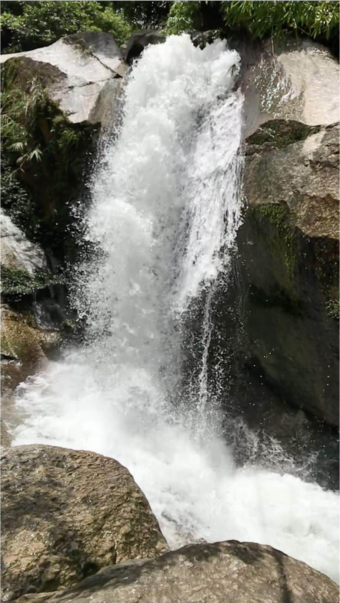
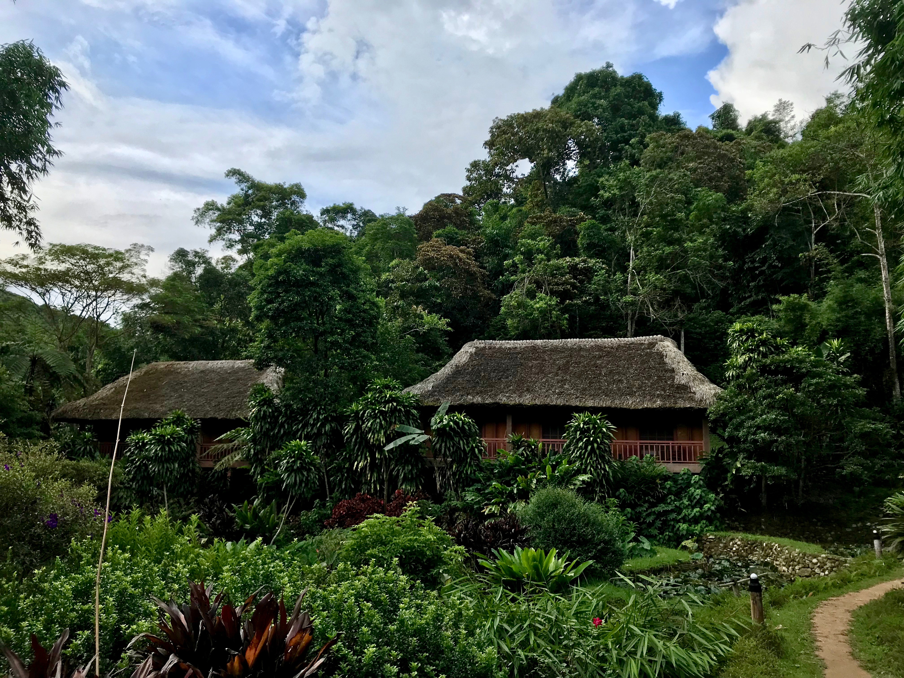
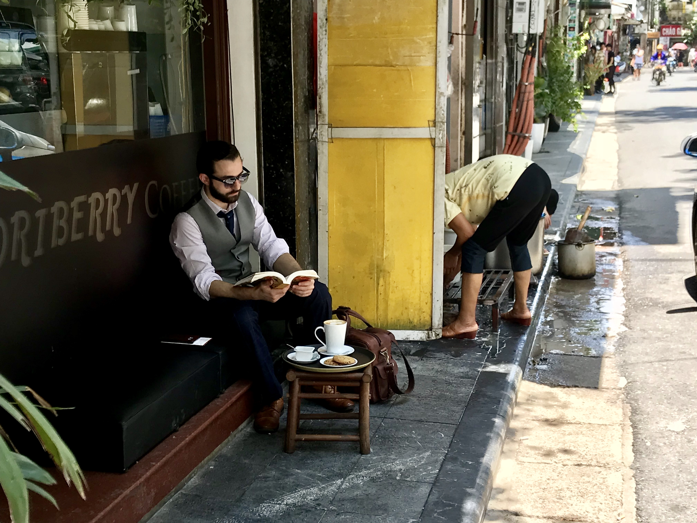
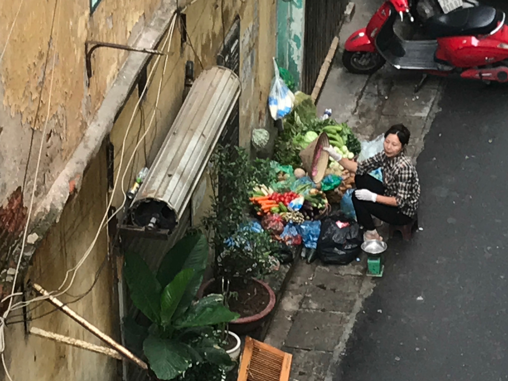

# Tills Year

One year. One picture per day.

## 2018-08-02 Waterfall in the jungle

(Click picture to see video)

<iframe width="560" height="315" src="https://www.youtube.com/embed/mxaVVtuWt_s?rel=0" frameborder="0" allow="autoplay; encrypted-media" allowfullscreen></iframe>

We discovered the surroundings of Pan Hou Village, and this waterfall was one of the highlights - especially for the kids...

## 2018-08-01 Jungle and rice

From [Pan Hou Village](https://www.panhou-village.com/en/) we did beautiful hikes through the jungle and the rice fields.

## 2018-07-31 Panhou Village

We spent a couple of days in [Pan Hou Village](https://www.panhou-village.com/en/) where we slept in nice jungle huts.

## 2018-07-30 Hanoi

This man was enjoying the streets of Hanoi, close by our hotel.

## 2018-07-29 Hanoi

We are in Hanoi, in a small hotel. This is the view from our window.

## 2018-07-28 Travel to Hanoi

Today we travel to Hanoi to meet our friends and spend holidays with them in Northern Vietnam.

## 2018-07-27 Da Nang

A family on their scooter standing next to me at a red light. I was on my way to an evening out with our interns.