## 2018-08-13 Beach again

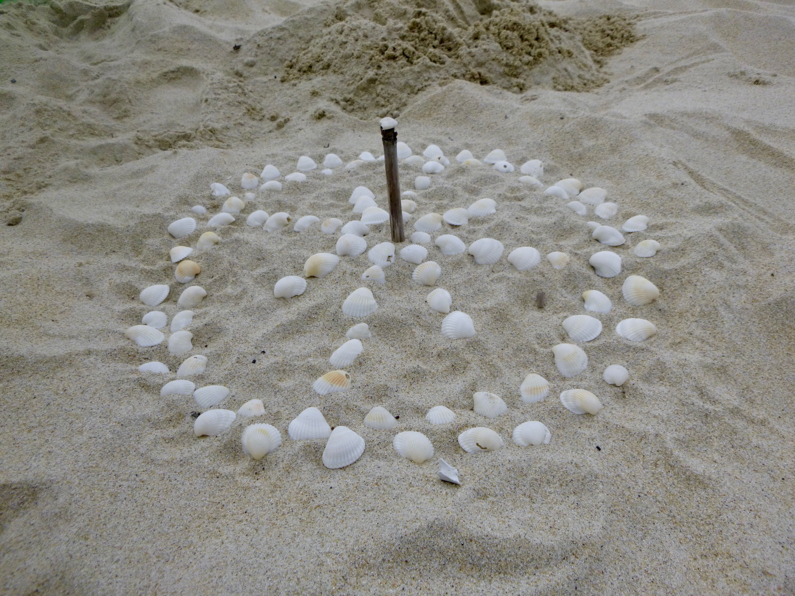

Kids can have so much fun at the beach.

## 2018-08-12 Da Nang Marathon

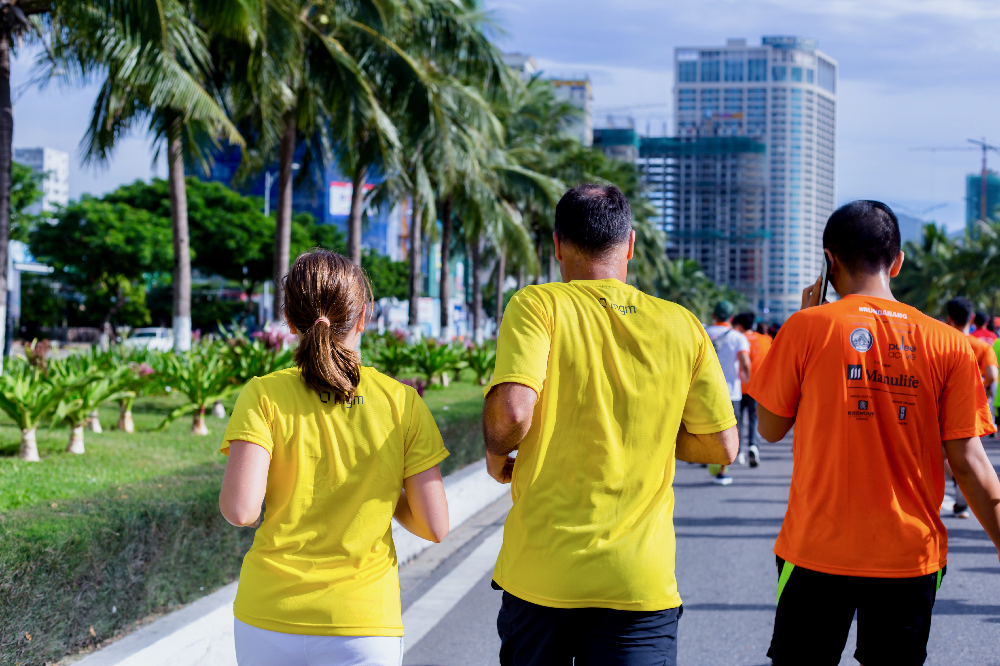

First officila race that I did with my 12 years old Lili. Probably next year I won't have to wait for her anymore and the year after she will have to wait for me.

## 2018-08-11 Beach in Da Nang

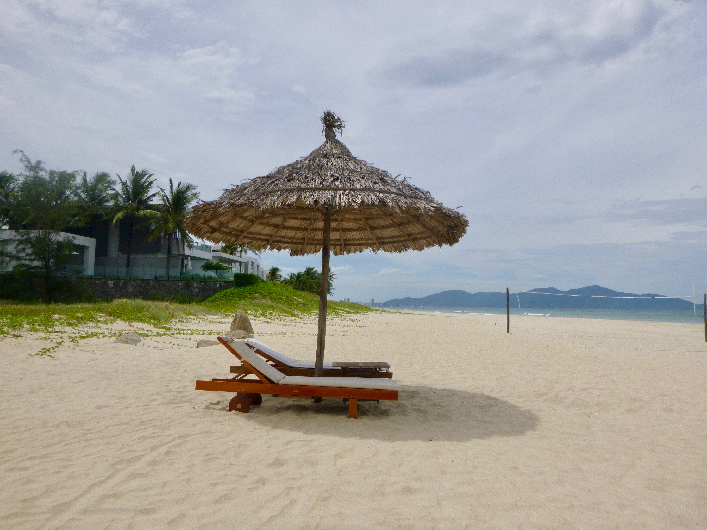

After so much traveling, what a joy to be back home!!

## 2018-08-10 Aerobic in Hai Phong

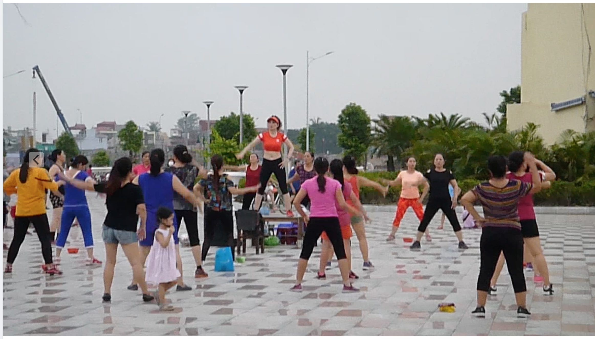

As in so many other cities of Vietnam, the women of Hai Phong also enjoy outdoor aerobic.

## 2018-08-09 Motorbike packing

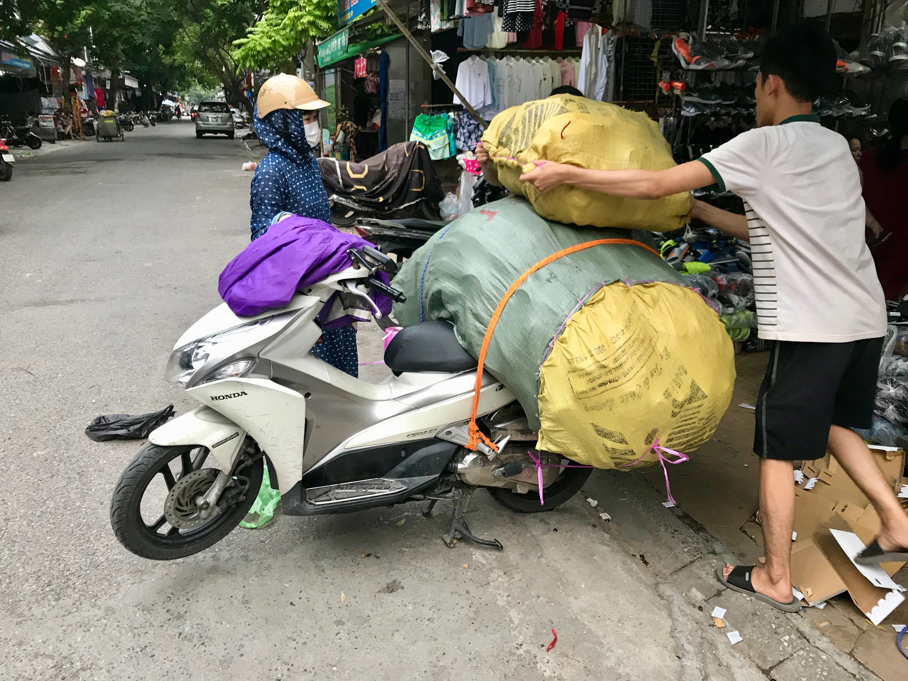

We all know the heavy packed motorbikes that drive around Vietnam. But we seldom see the difficult packing process...

## 2018-08-08 Best & cheapest Vietnamese food ever

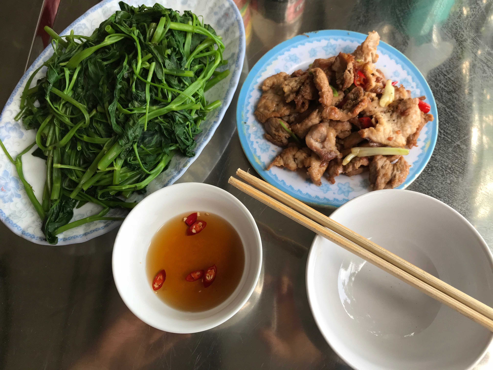

Outside of Ninh Bin, on the countryside I had probably the best and surely the cheapest Vietnamese food ever: Porc with rice and Morning Glory for 15'000 VND (~ 0.65 USD). And a very friendly, old Vietnamese lady that entertained me during my lunch...

## 2018-08-07 Les mariés du Dragon de Hang Múa

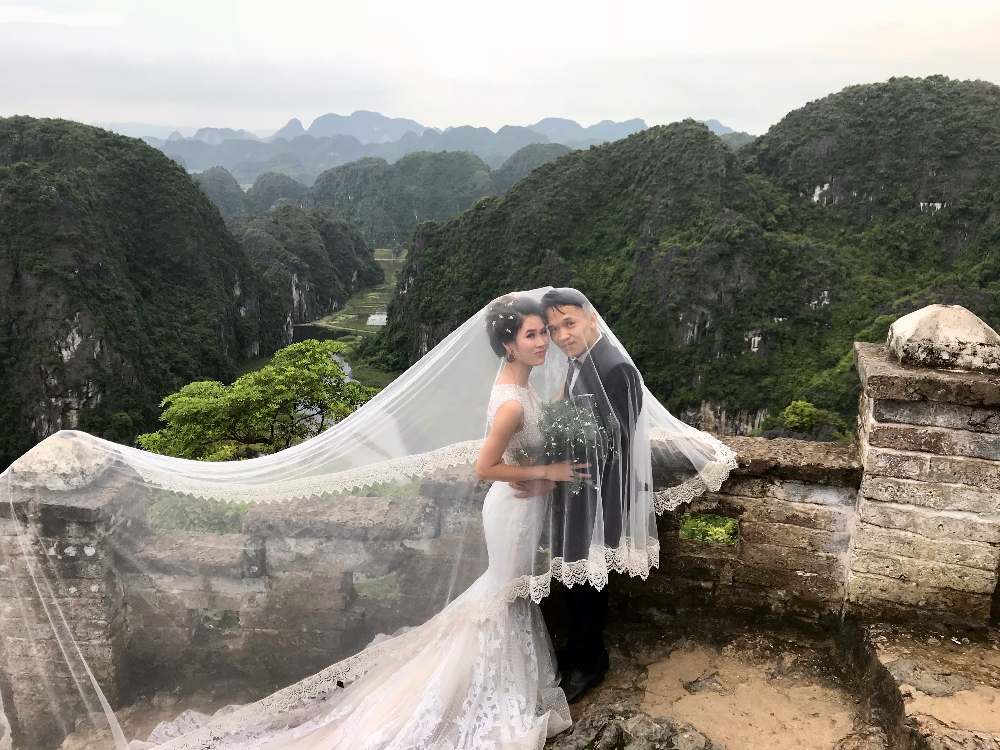

In the afternoon we climbed up the peak to a dragon statue from where we had a stunning view onto the [Hang Múa cave entries](https://goo.gl/maps/v5qtEdVBWHQ2): And we met a couple about to get married.

## 2018-08-06 Hanoi - Da Nang - Hanoi

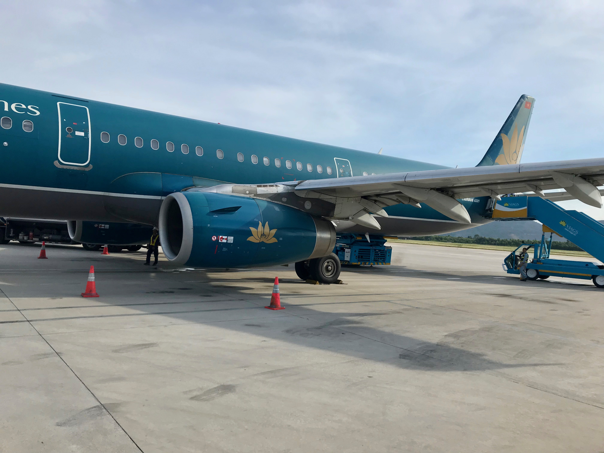

Usually I wouldn't post an airport picture, but this day was special: Due to passport problems I drove from [Pan Hou Village](https://www.panhou-village.com/en/) to Hanoi, took the plane to Da Nang to deliver a passport, and the next plane back to Hanoi.

## 2018-08-05 Market in  Vinh Quang

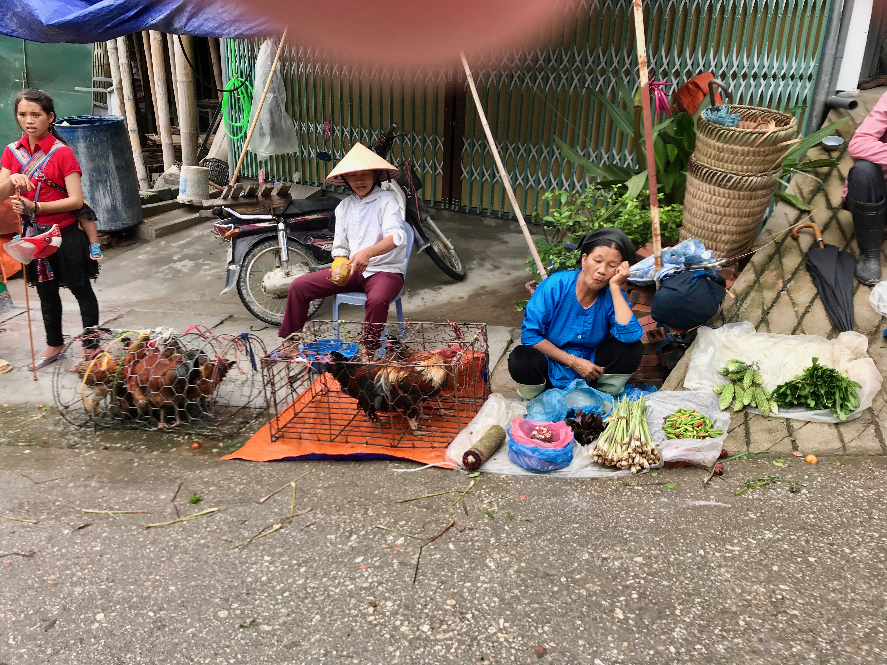

As sunday is the big market day in Vinh Quang, we took a morning trip there.

## 2018-08-04 Scooters off the road

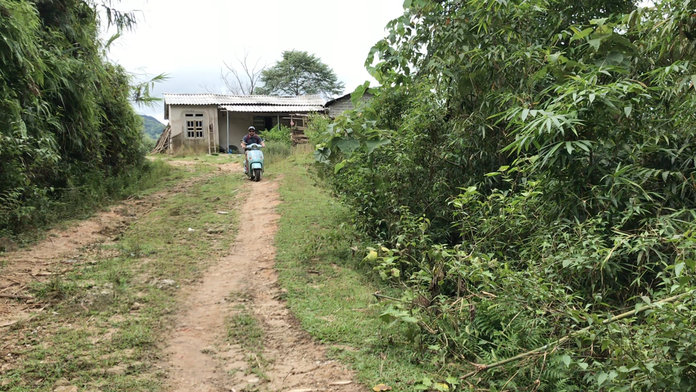

2 boys, 2 scooters and wild paths: More discovering of the valley around [Pan Hou Village](https://www.panhou-village.com/en/).

## 2018-08-03 Rice fields

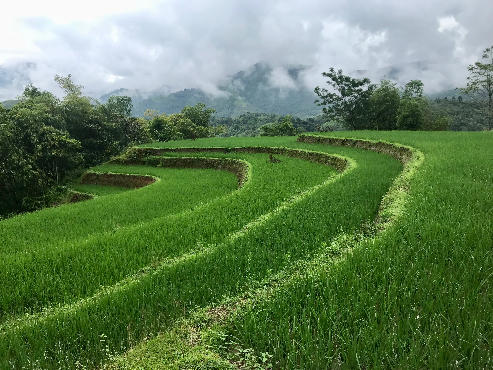

Another day of hiking and discovering the rice fields from within.

## 2018-08-02 Waterfall in the jungle

We discovered the surroundings of Pan Hou Village, and this waterfall was one of the highlights - especially for the kids...

## 2018-08-01 A horse in the house

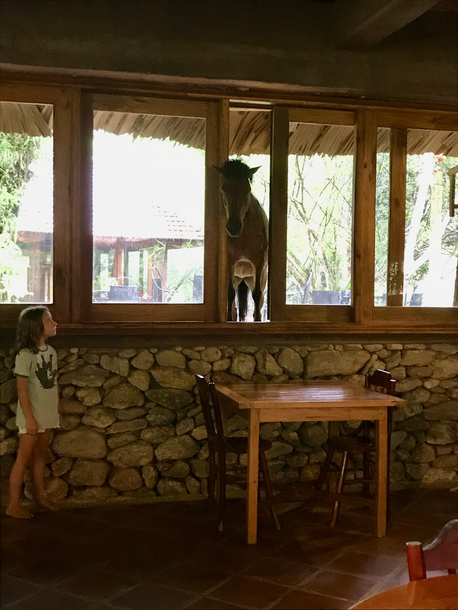

At [Pan Hou Village](https://www.panhou-village.com/en/) they have a horse - that likes to lurk through the window into the dining room...

## 2018-07-31 Panhou Village

We spent a couple of days in [Pan Hou Village](https://www.panhou-village.com/en/) where we slept in nice jungle huts.

## 2018-07-30 Hanoi

This man was enjoying the streets of Hanoi, close by our hotel.

## 2018-07-29 Hanoi

We are in Hanoi, in a small hotel. This is the view from our window.

## 2018-07-28 Travel to Hanoi

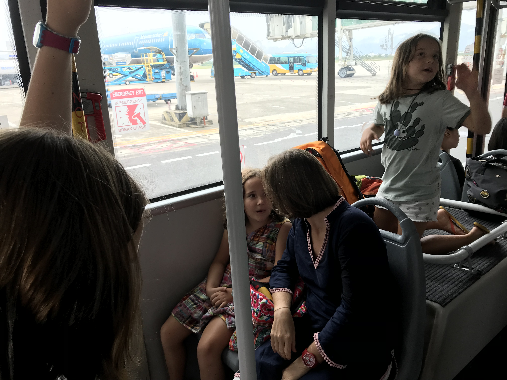

Today we travel to Hanoi to meet our friends and spend holidays with them in Northern Vietnam.

## 2018-07-27 Da Nang

A family on their scooter standing next to me at a red light. I was on my way to an evening out with our interns.